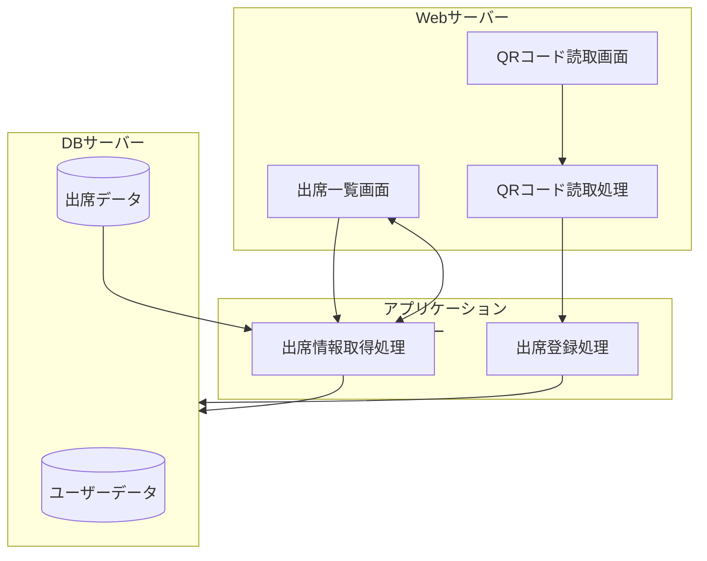

```mermaid
  flowchart TB
  subgraph s1["Webサーバー"]
          A2["QRコード読取画面"]
          get-f["出席一覧画面"]
          B3["QRコード読取処理"]
    end
  subgraph s2["アプリケーション<br>サーバー"]
          registerAttendance["出席登録処理"]
          getAttendances["出席情報取得処理"]
    end
  subgraph s3["DBサーバー"]
          C2[("ユーザーデータ")]
          WorkAttendance[("出席データ")]
    end
      A2 --> B3
      get-f --> getAttendances
      getAttendances <--> get-f
      WorkAttendance --> getAttendances
      B3 --> registerAttendance
      registerAttendance --> s3
      getAttendances --> s3
```